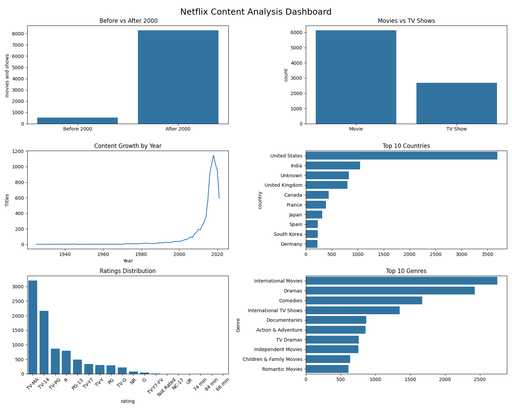

# 🎬 Netflix Dashboard Analyzer

## 🚀 Overview

This project analyzes Netflix's dataset to uncover trends in content distribution, genres, and growth over time.
The goal was to extract meaningful insights using data analysis and visualization techniques.

---

## 🛠️ Tech Stack

* Python
* Pandas
* Matplotlib / Seaborn

---

## 📊 Key Insights

* 📈 Netflix content saw a major surge after 2015
* 🎭 Drama and Comedy are the most dominant genres
* 🎬 Movies significantly outnumber TV shows on the platform
* 🌍 Content is heavily concentrated in a few countries

---

## 📸 Dashboard Preview



---

## ⚡ Features

* Data cleaning and preprocessing
* Exploratory Data Analysis (EDA)
* Visual representation of trends
* Genre and content distribution analysis

---

## ▶️ How to Run

```bash
pip install -r requirements.txt
python main.py
```

---

## 📌 Future Improvements

* Add interactive dashboard (Streamlit)
* Include more datasets for comparison
* Deploy as a web app

---

## 🤝 Contributing

Feel free to fork this repo and improve it!

---

## 📬 Contact

If you liked this project or want to collaborate, feel free to connect!

